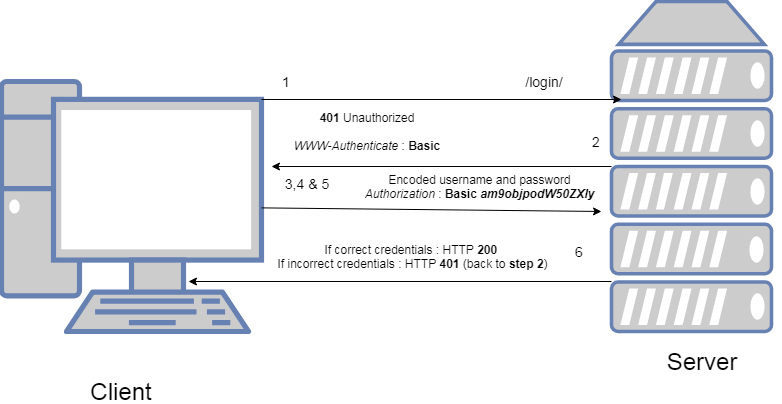

# Basic Authentication API

## Background Context
This project is all about authentication process and implement Basic Authentication on a simple API. Authentication is a critical aspect of securing web applications, ensuring that only authorized users can access certain resources or perform specific actions. 

Basic authentication is one of the simplest methods for implementing authentication in web applications. It involves sending a username and password encoded in Base64 format via the HTTP Authorization header. Despite its simplicity, basic authentication provides a basic level of security for protecting resources.

## Objective
Albeit the fact that implementing a custom basic authentication system is discouraged; this project aims to deepen the understanding of authentication mechanism by guiding through the process of implementing Basic Authentication on a simple API. 
By building the authentication mechanism from scratch, one understands how authentication works at a fundamental level. Through this hands-on approach, it is easy to grasp concepts such as encoding data in Base64, constructing HTTP headers, and validating user credentials.

## Learning goals
- What authentication entails
- Understanding of Base64 encoding
- Encoding a string in Base64
- Basic authentication principles
- Sending the Authorization header
