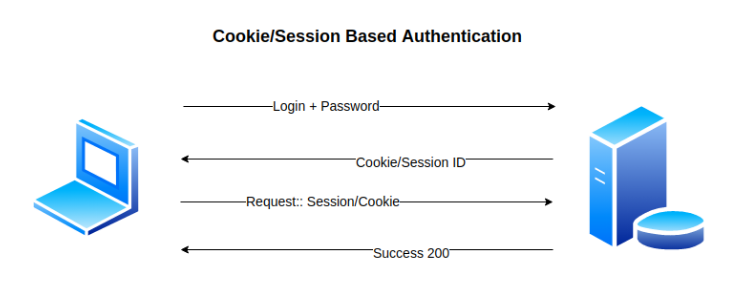

# Session Authentication

## Overview
Session authentication is a mechanism used to verify and manage user identity and access within a web application. Unlike traditional authentication methods that require users to provide credentials (such as username and password) with each request, session authentication establishes a temporary session between the user and the server after successful login. This session is typically maintained using a unique identifier stored as a cookie in the user's browser.

## Project description
In this project, Session Authentication is implemented without relying on any additional modules. Session authentication is a common mechanism used to validate and authorize users accessing web applications. While it's typically recommended to utilize established frameworks or modules for authentication, this project aims to provide a deeper understanding of the underlying concepts by implementing it from scratch.

## Key concepts
- The concept of authentication
- Session management (how sessions are created, managed, and terminated in web applications.)
- HTTP cookies are and how they are used to store small pieces of data on the client side (user's browser)
- HTTP requests and responses within a web framework
- Statelessness vs. Statefulness in web applications
- Session expiration and the mechanisms for setting session timeouts.
